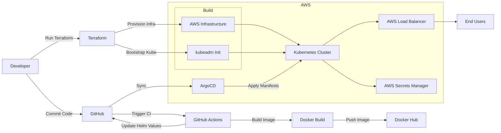

# telekemp

A full deployment of Kubernetes with `kubeadm` on EC2 instances. Telekemp is an exploration of the following technologies and how they interact: Teleport + Kubernetes + Nginx + MariaDB + Python (PHP?)


## Overview



## Infrastucture

### Terraform

All resources are controlled via Terraform. State is stored in the `telekemp-terraform-state` S3 bucket. When building a new cluster you can log into a node and monitor the bootstrap process from `/var/log/bootstrap.log`. Once the bootstraping process is complete, the control-plane stores connection data in AWS Secrets Manager and the worker node(s) will join the cluster automatically:

```
kubectl get nodes
kubectl get pods -A
```

> [!WARNING]
> This is not an EKS solution, meaning that it does not cleanly integrate with other AWS services out of the box: subnets, ALBs, etc. I have opted **not** to build a new VPC and related infrasture as part of this project meaning that you must **manually** tag the subnets in your desired VPC so that Istio can create the ALBs.

**Public Subnets**

```
kubernetes.io/cluster/telekemp: [ owned | shared ]
kubernetes.io/role/elb: 1
```

**Private Subets**

```
kubernetes.io/cluster/telekemp: [ owned | shared ]
kubernetes.io/role/internal-elb: 1
```

### Kubernetes

Kubernetes is bootstraped via Terraform using `user_data`; this includes basic cluster configuration. All associated scripts can be found [here](https://github.com/necrux/telekemp/tree/main/terraform/scripts).

> [!NOTE]
> Terraform is intended for cluster initialization only and any additional Kubernetes configuration should be moved outside of IaC. However many cluster initialization options have been exposed [here](https://github.com/necrux/telekemp/blob/main/terraform/variables.tf) for portability and training purposes.

### Applications

#### Containers

Container build instructions for each application can be found in the [docker](https://github.com/necrux/telekemp/tree/main/docker) directory. Images are stored in DockerHub:

* [Staticly](https://hub.docker.com/repository/docker/necrux/staticly)

```
docker tag staticly necrux/staticly:vX.X.X
docker push necrux/staticly:vX.X.X
```

> [!TIP]
> If the container tags increment, be certain to update the corresponding value in the Helm [chart](https://github.com/necrux/telekemp/blob/ceb98299c3a4ac599cb872a61708ee7a0d8320a3/helm/staticly/values.yaml#L14)!

#### Charts

Associated Helm charts are located [here](https://github.com/necrux/telekemp/tree/main/helm). 

## RBAC

Terraform variables give you the option to bootstrap the cluster with a namespace as well as a read-only role and a read-write role for that namespace. In order to leverage the created roles, you will need to create a user and bind them to the role as follows:

```
USER=<NEW_USER>
ORG=<MY_ORG>
CONTEXT=<MY_CONTEXT>
BINDING=<MY_BINDING>
ROLE=<RO_ROLE | RW_ROLE>  # If the exposed roles are not sufficient then you will need to create your own.

openssl genrsa -out ${USER}.key 2048
openssl req -new -key ${USER}.key -out ${USER}.csr -subj "/CN=${USER}/O=${ORG}"
sudo openssl x509 -req -in ${USER}.csr -CA /etc/kubernetes/pki/ca.crt -CAkey /etc/kubernetes/pki/ca.key -CAcreateserial -out ${USER}.crt
kubectl config set-credentials ${USER} --client-certificate=${USER}.crt --client-key ${USER}.key
kubectl config set-context ${CONTEXT} --user=${USER} --cluster=kubernetes
kubectl create rolebinding ${BINDING} --role=${ROLE} --user=${USER}
```

### Creating a Custom Role

```
function my-new-role {
cat << EOF
apiVersion: rbac.authorization.k8s.io/v1
kind: Role
metadata:
  namespace: <NAMESPACE>
  name: <NAME>
rules:
- apiGroups: [""]
  resources: ["pods"]
  verbs: ["VERBS"]
}
EOF
```

And apply the new role as follows:

```
kubectl apply -f <(my-new-role)
```

Testing RBAC:

```
kubectl config user-context ${CONTEXT}
kubectl -n kube-system get pods
```

## Deployment

Deploying the Helm chart can be done any number of ways but the simpliest option is to enable the ArgoCD deployment and configure a deployment pipline via the UI! This will ensure that changes to this repo, e.g. `dockerfile` updates or Helm updates, trigger a new build automatically.

## Access

Internal applications such as Whisker and ArgoCD have not been exposed over the Internet for security purposes. You can access them by using the [access-tools](https://github.com/necrux/telekemp/tree/main/access-tools) to create an SSH tunnel.

> [!NOTE]
> If you opted to deploy ArgoCD the default user is `admin` and the initial password will be displayed when running the [access script](https://github.com/necrux/telekemp/blob/main/access-tools/argocd-access.sh).

## Project Roadmap

* Fix ALB deployments for istio (disallowed for new AWS accounts; AWS ticket pending).
* Configure DNS.
* Set up cert-manager.
* Configure GitHub Actions for Docker build.
* Complete Teleport deployment.
* Templatize the Istio charts.
* Modularize the Terraform build.
* Deploy a second app with a database backend in order to test Teleport integration.
* Migrate much of the `user_data` to Ansible.

## Production Ready Roadmap

* Switch to EKS.
* Switch the container registry to ECR.
* Add a CI/CD pipeline for Terraform, e.g. Jenkins.
* Clearly defined config managerment outside of IaC, e.g. Ansible.
* Add unit tests.
* Add tests to the Helm chart.
* Move away from monlithic repos.
* `etcd` snapshots

## Sources

* [Istio: Version Compatibility](https://istio.io/latest/docs/releases/supported-releases/#support-status-of-istio-releases)
* [ArgoCD: User Management](https://argo-cd.readthedocs.io/en/release-1.8/operator-manual/user-management/)
* [Configure Flux](https://fluxcd.io/flux/installation/#configure-the-flux-instance)
